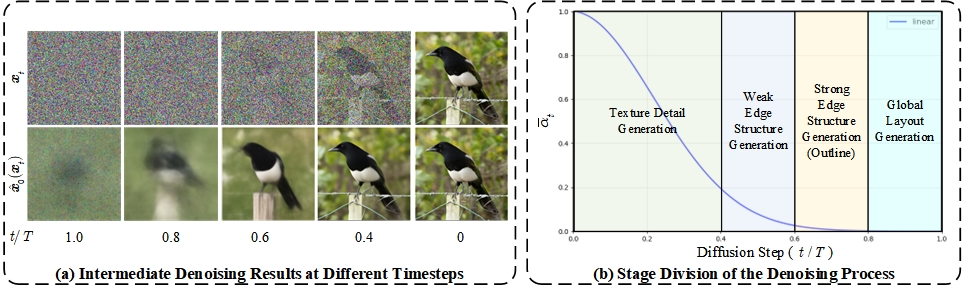

# GuidPaint: Class-Guided Image Inpainting with Diffusion Models
[[Paper]](https://arxiv.org/pdf/2507.21627)


## Abstract
In recent years, diffusion models have been widely adopted for image inpainting tasks due to their powerful generative capabilities, achieving impressive results. Existing multimodal inpainting methods based on diffusion models often require architectural modifications and retraining, resulting in high computational cost. In contrast, context-aware diffusion inpainting methods leverage the model's inherent priors to adjust intermediate denoising steps, enabling high-quality inpainting without additional training and significantly reducing computation. However, these methods lack fine-grained control over the masked regions, often leading to semantically inconsistent or visually implausible content.
To address this issue, we propose GuidPaint, a training-free, class-guided image inpainting framework. By incorporating classifier guidance into the denoising process, GuidPaint enables precise control over intermediate generations within the masked areas, ensuring both semantic consistency and visual realism. Furthermore, it integrates stochastic and deterministic sampling, allowing users to select preferred intermediate results and deterministically refine them. Experimental results demonstrate that GuidPaint achieves clear improvements over existing context-aware inpainting methods in both qualitative and quantitative evaluations.


## Requirements
### Environment
The code requires `python>=3.8`, as well as `pytorch>=1.7` and `torchvision>=0.8`.
Install conda environment by running
```
conda env create -f environment.yaml
conda activate guidpaint
```

### Download pretrained models and datasets
```shell
bash scripts/download.sh
```

## Image Inpainting via Diffusion Models with Classifier Guidance
### Use GuidPaint
For ImageNet, we use a pre-trained classifier (--use_classifier) to predict the labels (--use_pred_y) of input images, or you can also customize the labels (--labels) based on `file` `ILSVRC2012-Label-Key-Categories.txt`. For Celeba-HQ, the diffusion model is unconditional (no y), therefor we only use stochastic sampling without classifier.

Use different skip sampling steps (--ddim.schedule_params.schedule_type respace) according to different stages of denoising. 
Use fewer steps early for faster denoising, and more steps later for finer details (--ddim.schedule_params.infer_step_repace 125,1).
When the sampling step is 250, clearer structures emerge between steps 100-150. 
You can select an intermediate generation (--optimize_xt.comb_stop_step) with both semantic consistency and visual plausibility as the initial condition for deterministic sampling.



```text
Input Parameter Description:
python guidpaint.py
    --config_file       Path to the main config file
    --input             Path to a single image or a folder containing multiple images
    --outdir            Path to the folder where results will be saved
    --mask              Custom mask path (Path to a single mask or a folder containing multiple masks)
    --labels            Specifies the class label(s) to associate with each mask.
    --mask_type         Given the mask type, generated by the mask generator 
    --gpu               GPU selection (Default: 0)
    --debug             Save intermediate generations for selection (default: not saved)
    --seed              Set random seed (default: 42)
    --use_classifier    Use classifier (default: not used, automatically used for guidpaint)
    --use_pred_y        Use classifier to predict class labels (default: not used)
    --pred_y_top_k      Number of predicted labels (default: 3)
    --ddim.schedule_params.schedule_type          Set respace as skip sampling (default: linear)
    --ddim.schedule_params.infer_step_repace      Set the step division for skip sampling (e.g., 1,1: divides into two parts, 1 step each, resulting in sampling steps {0, 125, 249}).
    --stage1.use_guidance                         Stage 1 uses class guidance (default: disabled, default is global guidance, suitable for incomplete targets)
    --use_local_guid                              Use local guidance (default: disabled, suitable when there are no incomplete targets)
    --optimize_xt.coef_guid                       Guidance scale (default: 1.0)
    --optimize_xt.guid_stop_step                  Guidance stop timestep (default: 100th step)
    --no-optimize_xt.optimize_xt                  Disable repair constraints (default: enabled)
    --optimize_xt.inp_start_step                  Inpainting constraints start timestep (default: 249th step)
    --no-optimize_xt.use_comb                     Disable stochastic sampling (default: enabled)
    --optimize_xt.comb_start_step                 Stochastic sampling start step (default: 249th step)
    --optimize_xt.comb_stop_step                  Stochastic sampling stop step (user-defined, default: 100th step)
    --optimize_xt.num_iteration_inp               Inpainting constraint iterations (default: 2)
    --optimize_xt.num_iteration_guid              Class guidance iterations (default: 2)
    --stage1.use_timetravel                       Stage 1 uses resampling (default: disabled)
    --ddim.schedule_params.jump_length            Resampling backtrack length (default: 10 steps)
    --ddim.schedule_params.jump_n_sample          Resampling backtrack attempts (default: 1)
    --ddim.schedule_params.jump_start_step        Resampling start timestep (default: 230th step)
    --ddim.schedule_params.jump_end_step          Resampling stop timestep (default: 0th step)
 
Predefined mask types:
    expand, half, square, line, sr2, random, text, text_cat, full
Mask missing area ratio: 
    full: 100%(No inpainting constraints, only used for detecting the generation of the diffusion model);
    expand: 75%, half: 50%, square: 25%;
Guidance scale range:
    DDPM 250 steps(256*256): classifier guidance scale [0.5, 1.0, 1.5], best 1.0;
    DDIM  25 steps(256*256): classifier guidance scale [0.5, 1.0, 1.5, 2.0, 2.5, 3.0, 3.5], best 2.5;
```

Here is an example of using GuidPaint with skip sampling for local guidance. 
```shell
python guidpaint.py --config_file configs/config.yaml --input datasets/test --output result --mask_type half --labels 130 --debug  --stage1.algorithm guidpaint --stage1.use_guidance --use_local_guid --optimize_xt.comb_stop_step 100 --ddim.schedule_params.schedule_type respace --ddim.schedule_params.infer_step_repace 1,1,1,1,1
```

### Experiments Reappearance
We provide shell scripts for `guidpaint, guidpaint-skip, repaint, copaint-tt` in `scripts` folders.
```shell
bash scripts/guidpaint.sh
```
## Reference
For more details, please refer to our paper. If you find our work useful, we would appreciate your citation.

@misc{wang2025guidpaintclassguidedimageinpainting,
      title={GuidPaint: Class-Guided Image Inpainting with Diffusion Models}, 
      author={Qimin Wang and Xinda Liu and Guohua Geng},
      year={2025},
      eprint={2507.21627},
      archivePrefix={arXiv},
      primaryClass={cs.CV},
      url={https://arxiv.org/abs/2507.21627}, 
}

Our implementation is based on following repos:
* https://github.com/andreas128/RePaint
* https://github.com/openai/guided-diffusion
* https://github.com/UCSB-NLP-Chang/CoPaint

